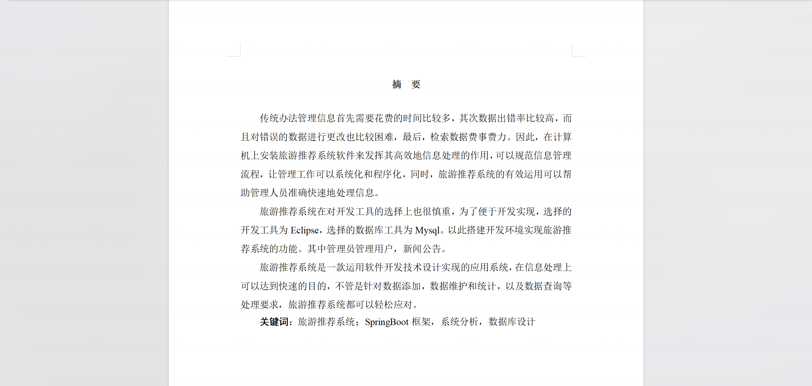
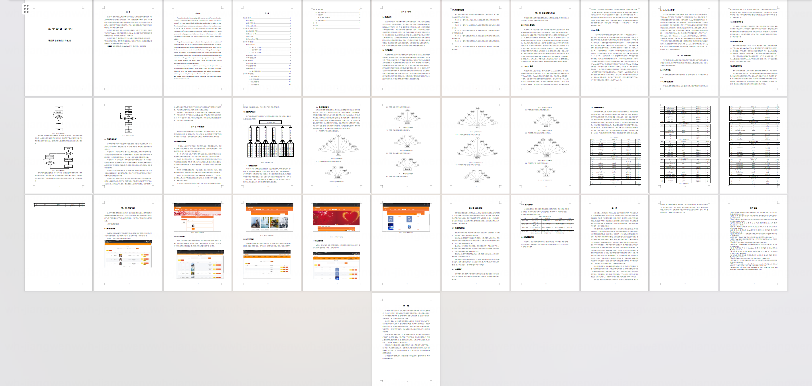
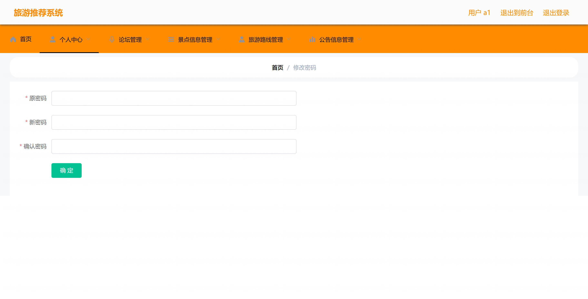
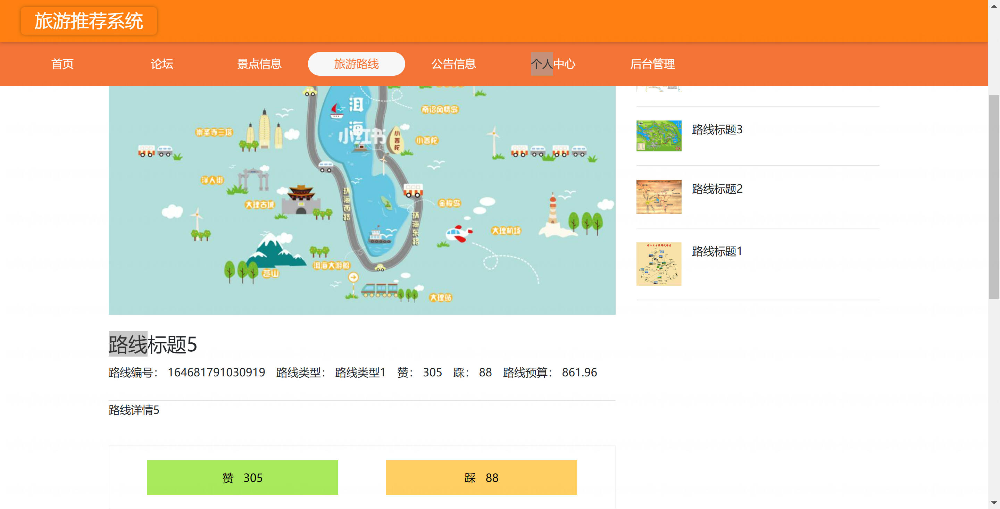
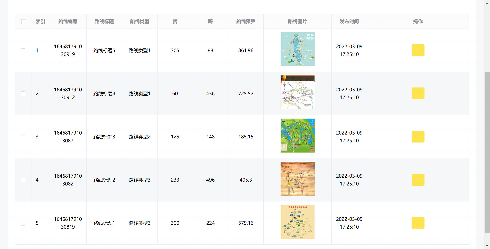
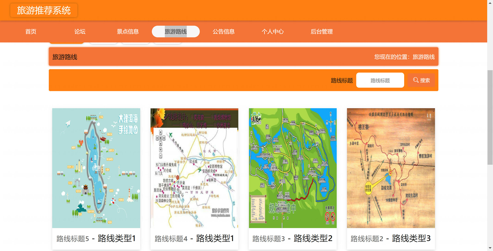
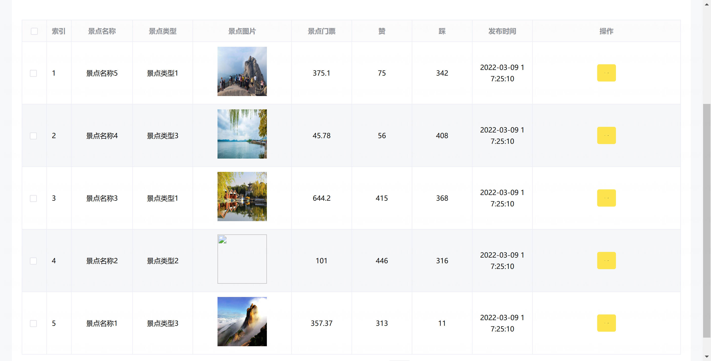
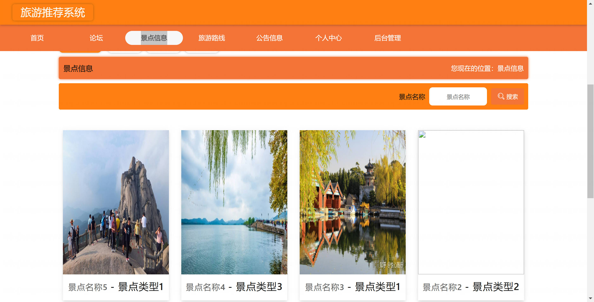
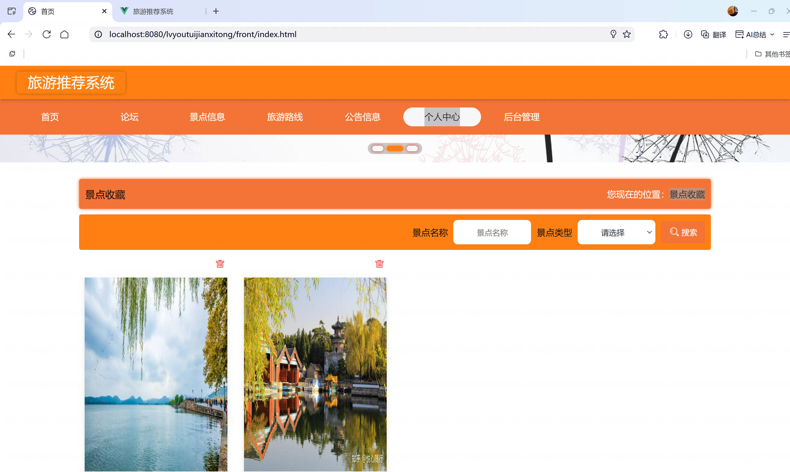

<h1 align="center">基于SpringBoot+Vue的旅游推荐系统系统【带论文】</h1>

- <b>完整代码获取地址：从戎源码网 ([https://armycodes.com/](https://armycodes.com/))</b>
- <b>技术探讨、资料分享，请加QQ群：692619798</b>
- <b>作者微信：19941326836  QQ：3645296857</b>
- <b>承接计算机毕业设计、Java毕业设计、Python毕业设计、深度学习、机器学习</b>
- <b>选题+开题报告+任务书+程序定制+安装调试+论文+答辩ppt 一条龙服务</b>
- <b>所有选题地址 ([https://github.com/Descartes007/allProject](https://github.com/Descartes007/allProject)) </b>

## 一、项目介绍

### 基于SpringBoot+Vue的旅游推荐系统，系统角色为管理员、用户，主要功能如下
### 管理员：
- 基本操作：登录、修改密码、获取个人信息、修改个人信息
- 轮播图管理：新增轮播图、获取轮播图列表、查看轮播图详情、修改轮播图、删除轮播图
- 论坛管理：获取帖子列表、筛选帖子、查看帖子详情、发布帖子、修改帖子、删除帖子
- 景点信息管理：筛选景点、获取景点列表、查看景点详情、新增景点、修改景点、删除景点
- 景点留言管理：获取景点留言列表、筛选留言、查看留言详情、删除留言
- 景点收藏管理：获取景点收藏列表、筛选收藏、查看收藏详情、删除收藏
- 旅游路线管理：筛选路线、获取路线列表、查看路线详情、新增路线、修改路线、删除路线
- 路线留言管理：获取路线留言列表、筛选留言、查看留言详情、删除留言
- 路线收藏管理：获取路线收藏列表、筛选收藏、查看收藏详情、删除收藏
- 公告信息管理：筛选公告、获取公告列表、查看公告详情、新增公告、修改公告、删除公告
### 管理员账号管理：筛选管理员、获取管理员列表、查看管理员详情、新增管理员、修改管理员、删除管理员
- 用户管理：筛选用户、获取用户列表、查看用户详情、新增用户、修改用户、删除用户
- 用户：
- 基本操作：注册、登录、修改密码、获取个人信息、修改个人信息
- 首页与推荐：查看轮播图、查看推荐景点与旅游路线
- 景点信息：浏览景点列表、搜索景点、查看景点详情、收藏/取消收藏、对景点留言
- 旅游路线：浏览路线列表、搜索路线、查看路线详情、收藏/取消收藏、对路线留言
- 公告信息：浏览公告列表、查看公告详情
- 论坛：浏览帖子、发布帖子、查看帖子详情
- 个人中心：查看/修改个人信息、查看我的收藏、查看我的留言与我的帖子

## 二、项目技术

- 编程语言：Java
- 项目架构：B/S架构
- 前端技术：Vue 2、Vue Router、ElementUI、Axios、Quill 编辑器
- 后端技术：SpringBoot、MyBatis、MyBatis-Plus、MySQL、FastJSON、Hutool

## 三、运行环境

- JDK版本：1.8及以上都可以
- 操作系统：Windows7/10、MacOS
- 开发工具：IDEA、Ecplise、MyEclipse都可以

## 四、数据库配置文件

- npm版本：6.14.13及以上都可以
- Redis版本：3.2.100及以上都可以
- 文件名：application.yml
- 编码类型：utf8

## 论文截图

## 系统截图

